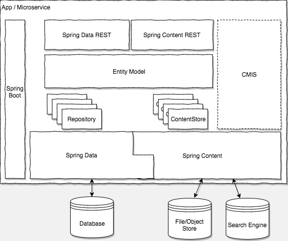

# Spring Content

Cloud-Native Headless Content Services for Spring.

For creating services that manage content such as documents, images and digital assets such as video.  

Build your own cloud-native, scale-out headless content services using the exact same components as the Enterprise Content Management (ECM) vendors such as Documentum and OpenText, without the hassle.   

#### Features

- Standardized content access no matter where it lives  
- Associate content with metadata   
- Search inside content
- Transform content into different formats with an extensible Rendtion mechanism 

#### Modules

Spring Content provides modules for storing content in S3, Filesystem, MongoDB and JPA _(with DellEMC ECS coming soon)_ and provides modules for content search for Apache Solr _(with Amazon Elastic Search also coming soon)_. 

#### Overview

_Figure 1. understanding how Spring Content fits into the Spring eco-system_


## Quick Start

```
<dependency>
    <groupId>com.github.paulcwarren</groupId>
    <artifactId>spring-content-fs-boot-starter</artifactId>
    <version>0.0.3</version>
</dependency>
```

For a quick taste, look at the following domain object:

```
@Entity
public class SopDocument {
	
	private @Id @GeneratedValue Long id;
	private String title;
	private String[] authors, keywords;
	
	// Spring Content managed attribute
	private @ContentId String contentId;

  	private SopDocument() {}
	public SopDocument(String title, String[] authors, String[] keywords) 	{
		this.title = title;
		this.authors = authors;
		this.keywords = keywords;
	}
}
```

This defines a simple JPA entity with a few structured data fields; title, authors and keywords and one Spring Content-managed data field; @ContentId.  

The structured data fields are handled in the usual way through a `CrudRepository<SopDocument,String>` interface.  

Content is handled separately with a ContentStore interface:-

```
public interface SopDocuemntContent extends ContentStore<SopDocument, String> {
}
```

This interface extends Spring Content’s ContentStore, defines the type (SopDocument) and the id type (String).  Put this code inside a Spring Boot application with `spring-boot-starter-data-jpa` and `spring-content-fs-boot-starter` like this:

```
@SpringBootApplication
public class MyApp {

    public static void main(String[] args) {
        SpringApplication.run(MyApp.class, args);
    }
}
```

Launch your app and Spring Content (having been autoconfigured by Boot) will automatically craft a concrete set of operations for handling content associated with this Entity:

- `setContent(S property, InputStream content)`
- `InputStream getContent(S property)`
- `unsetContent(S property)`

To see more following out first [Getting Started Guide](spring-content-fs-docs.md), or watch our [SpringOne 2016 talk](https://bit.ly/springone-vid).

## References

- [Spring Content Filesystem](refs/fs-index.html)


